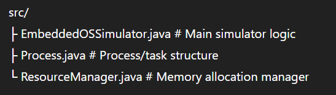
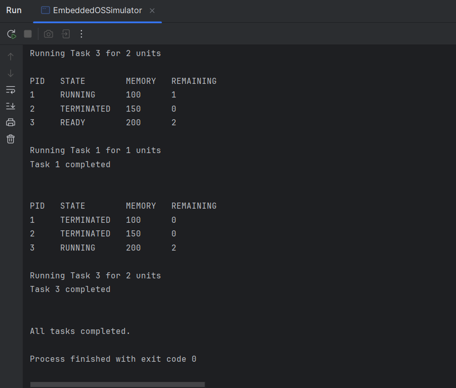

# Embedded OS Simulator

A Java-based simulator that demonstrates key **Embedded Operating System concepts** including task scheduling, process execution, and resource allocation.

## Features

- Round Robin Task Scheduling
- Process State Management (READY, RUNNING, TERMINATED)
- Resource Allocation using a Memory Manager
- Console-based Process Table Simulation
- Dynamic task execution with time quantum

## Concepts Demonstrated

This project illustrates how embedded operating systems manage multiple tasks efficiently in a constrained environment.

Key concepts include:

- Task Scheduling (Round Robin)
- Process Execution
- Resource Allocation
- Process State Transitions

## Project Structure

## Example Output

## How to Run

1. Open the project in IntelliJ IDEA
2. Run `EmbeddedOSSimulator.java`
3. Enter number of tasks, burst times, memory requirements, and time quantum.

## Author

Tavleen Kaur  
B.Tech IT — University of Mumbai
